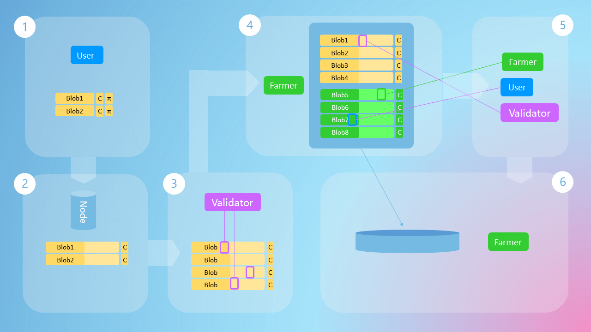

# Lifecycle of Blob_tx

## User Encodes Data

Users split the data they need to submit into Blobs, calculate polynomial commitments for each blob, and complete a challenge to prove that the data has been encoded correctly.

## Submit Blobs and Transactions

Users construct encoded metadata into a transaction and submit it to the node along with the original data. The node pushes the transaction into the transaction pool, then verifies if the encoding has been done correctly and if it matches the metadata in the transaction. If everything is correct, the original data will be pushed to the peer-to-peer network. It's worth noting that if the data hasn't been encoded correctly, the transaction will still be pushed to the transaction pool, but the node won't push the data. This is done to prevent Denial of Service attacks.

In the final version, the original data will not propagate among validators, and users can use various ways to publish data and submit transactions. For example, they can initiate transactions and push data directly through a light client, or submit original data and transactions to the node's RPC port, or just submit the transaction and publish the data on their own.

## Validators Preliminarily Determine Availability

After building a block, validators will preliminarily validate the availability of the data. This is a very lenient validation, aiming to improve system robustness. In the current version, validators need to download all data from the peer-to-peer network for validation. In the next phase that's about to be completed, validators only need to use inexpensive sampling.

If validators find the data unavailable, they will initiate an unavailability report. When the number of reporting validators reaches a certain threshold, the data will be marked as unavailable. All other available data will be encoded into the block header.

Currently, we have set a delay of 1 block, meaning the data of the current block will be encoded in the header of the next block. This is done to provide a sufficient time window to report unavailable data. In the final version, we will use aggregate signatures to efficiently confirm unavailable data, and the data of the current block will be immediately encoded in the block header.

## Farmers Distributively Produce Data

When the block reaches its Best state, farmers retrieve rows and columns they need to download from the block header information and then expand columns to double their size.

## Availability Sampling

Once the block with the data availability header reaches its finality, validators, farmers, and users (light clients) will simultaneously sample, obtaining the final confidence value through multiple sampling rounds. Farmers at this stage need to obtain a wider range of data, ensuring there are enough sampling nodes in the system.

## Distributed Storage

After the sampling phase is completed, farmers will save specific rows and columns to distributed storage.
