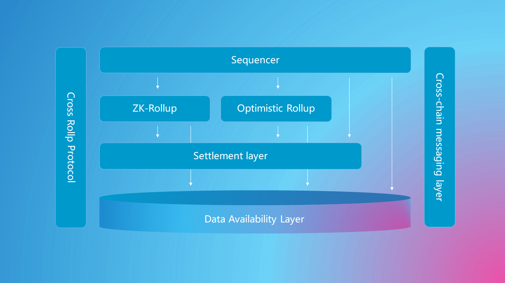

# Modular Blockchain

The concept of a modular blockchain is undefined for now. We are currently using it to refer to a blockchain architecture that adheres to domain-driven design principles, so it might differ from the concept of "modularity" you're familiar with. We'll briefly cover two core issues addressed by modular blockchain:

## Train Ticket-Hotel Problem

Current blockchain modules are highly intertwined. This issue becomes amplified when designing shards, leading to the so-called "Train-And-Hotel Problem". During this period, Rollup technology evolved as a Layer2 solution, which can be seen as an embryonic form of modular blockchain, significantly enhancing the TPS of blockchains. Subsequently, data availability layers, sequencers, and message services were decoupled, clarifying the architecture of modular blockchains.

- **Sequencer**: Transaction ordering and state transition conversion
- **Middleware**: Ensures the legitimacy of sorting, correctness of state transition, and depending on the specific design, it may include some degree of "consensus"
- **Settlement Layer**: Provides the environment for verifying evidence, resolving fraud, settling funds, anchoring state, etc.
- **Messaging Layer**: Provides decentralized messaging services across Rollups, across settlement layers, and across chains
- **Data Availability Layer**: Serves all the above layers, ensuring that transaction data is actually available and user-friendly

## Fridge-Safe Problem

Undoubtedly, the modular blockchain enhances system throughput, but it also addresses another more significant problem. Different products have varying security assumptions, leading to distinct consensus needs. For instance, in social networks, the order of follower transactions isn't sensitive. In contrast, the sequence of Defi and NFT transactions is crucial for system security. However, in a unified consensus blockchain, they both pay for the same consensus mechanism. This is akin to storing a coke in a safe instead of a fridge, which we call the "Fridge-Safe Problem".

Consider this design pattern: Rollups on the same settlement layer possess different security models, and they interact through some protocol, enabling adaptive security for Rollups without added costs. For example, users expect interactions with social network applications to be free, demanding a lightweight "consensus". But the social relationships derived from these networks, which hold protocol value and are depended upon by many other applications, require a robust "consensus". To resolve this paradox, given most protocol applications are "read-only", we can design a "read-only" cross-Rollup protocol. When a relied-upon application faces challenges and is curtailed, all applications dependent on it within two steps face the same limitation. Thus, even if the social network operates on a permissioned blockchain, applications depending on it will validate it for security reasons. This ensures that the more extensively an application is used, the more secure it becomes, introducing a security-adaptive transaction paradigm that doesn't escalate user costs and maintains on-chain data availability (on the same settlement layer).
