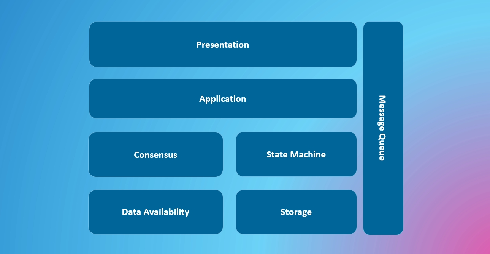

# Modular Blockchain

Modular blockchain is an undefined concept, temporarily used to refer to blockchain architectures that align with the idea of domain-driven design. Therefore, it might not be the same as the "modular" concept you are familiar with.

## Architecture

**Consensus Layer and State Machine**

At its core, a blockchain is a finite state machine that can change states through external commands. To achieve global consensus on state changes, a consensus layer is needed. They are the core parts of a blockchain, where the consensus layer and the state machine are actually independent. In the Substrate framework, there are many consensus layer Pallets that make up the Runtime together with the state machine; in Cosmos, the state machine and consensus layer are explicitly decoupled; in Ethereum's latest architecture, the consensus layer and execution layer are also decoupled.

In Rollups, we often refer to the consensus layer as the settlement layer, where transactions are executed off-chain, and the final state root is kept on the settlement layer, essentially serving the role of consensus.

**Message Queue Service**

The messaging layer is an indispensable part of software engineering, allowing reliable communication between system modules, each performing its role. In the context of blockchains, cross-chain messaging comes to mind, such as cross-chain bridges that communicate between two chains, or cross-chain messaging protocols like XCM (Cross-Consensus Message format) and IBC (Inter-Blockchain Communication).

In fact, another important messaging layer is the blockchain itself. We consider Bitcoin, Polkadot, and Ethereum as reliable messaging services. Bitcoin's Ordinals, BRC20, and other protocols transmit sequential instructions and protocolize the state machine on the Bitcoin network, ideally allowing all users to verify transactions without trusting a third party. In the Ethereum ecosystem, there was an early proposal to implement ERC20 through logs.

Although inscriptions are not widely regarded as modular blockchains, from a technical perspective, they treat the monolithic blockchain as a message queue service, aligning with the concept of modular blockchains. The advantage of inscriptions is that all nodes can reach consensus without the need for communication, greatly expanding the throughput of blockchains. However, the downside is also evident, as the messaging service layer can only transmit very limited information, making it difficult for the inscription system to expand, such as in smart contract functionalities. If we securely store data in another module and only publish pointers to the data in the messaging layer, ensuring that all nodes can maintain consistency on data availability at any time, we can greatly expand the inscription system. This is very useful for monolithic blockchains such as Bitcoin and Ethereum.

## The "Fridge Safe" Problem

Undoubtedly, modular blockchains enhance system throughput, but at the same time, they address another more important issue. Different products have different security assumptions, leading to different consensus requirements. For example, in social networks, the order of relationship transactions is not sensitive, while the order of DeFi and NFT transactions is a very important part of system security. However, in a blockchain with unified consensus, they need to pay for the same consensus mechanism. This is like not putting cola in a fridge but a safe, which we call the "Cola Safe Problem."

Consider a design pattern where Rollups on the same settlement layer have different security models and interact with each other through some protocol, enabling Rollups to achieve adaptive security at the same cost. For example, users expect interactions in social network applications to be free, which requires "consensus" to be as light as possible. However, the social relationships generated by social networks have protocol value, relied upon by many other applications, requiring "consensus" to be as secure as possible. To resolve this contradiction, we can utilize the fact that most protocol applications are "read-only," designing a "read-only" cross-Rollup protocol, where applications that depend on a challenged application are equally reduced. Therefore, even if the social network is based on a permissioned blockchain, for security considerations, applications that depend on it will also verify it. Thus, the more widely used an application is, the higher its security, bringing about a transaction paradigm that is security adaptive without increasing user costs, while also ensuring on-chain data availability (on the same settlement layer).