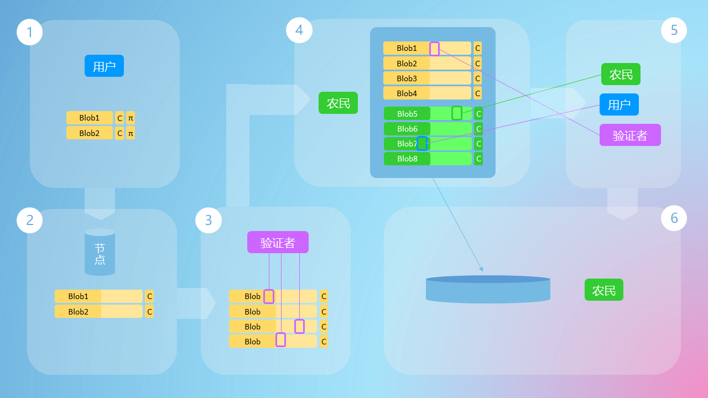

# Blob_tx 的生命周期

## 用户编码数据

用户将需要提交的数据分割为 Blob ，计算每个 blob 的多项式承诺，并完成一个用于证明数据被正确编码的挑战。

## 提交 blobs 和交易

用户将编码后的元数据构造为交易，并和原始数据一同提交至节点。节点将交易推送到交易池，之后验证编码是否被正确执行，与交易中的元数据是否相符，如果一切无误，将把原始数据推送到点对点网络。需要注意的是，如果数据未被正确编码，交易仍然会被推送到交易池，但节点不会推送数据，这么做是为了防止拒绝服务攻击。

在最终版本中，原始数据并不会在验证者中传播，并且用户可以用多种方式发布数据和提交交易，例如可以通过轻客户端直接发起交易和推送数据，也可以向节点 RPC 端口提交原始数据和交易，或者只提交交易，自行发布数据。

## 验证者初步确定可用性

验证者在完成一个区块构建后，将初步验证数据可用性。这是一个非常宽松的验证，目的是提高系统健壮性。在当前版本中，验证者需要从点对点网络中下载所有数据来验证，在即将完成的下个阶段中，验证者只需要通过便宜的抽样即可。

验证者发现数据不可用则会发起不可用性报告，当发起报告的验证者达到一定阈值时，数据将会被标记为不可用。其他所有可用的数据将会被编码到区块头。

目前我们设置了 1 区块的延时值，即当前区块的数据将在下一个区块被编码到区块头。这么做的目的是为了提供足够的时间窗口报告不可用数据。在正式版本中，我们将采用聚合签名来高效地确认不可用性数据，当前区块的数据将立即编码到区块头中。

## 农民分布式生成数据

当区块达到 Best 之后，农民从区块头信息中获取自己需要下载的行和列，之后扩展列到双倍大小。

## 可用性采样

当包含了数据可用性区块头的区块达到终结后，验证者、农民和用户（轻客户端）将同时进行采样，通过多次的采样获取最终的信心值。农民在此阶段需要获取更大范围的数据，这保证了系统中有足够多的采样节点。

## 分布式存储

抽样阶段完成后，农民将特定的行和列保存到分布式存储。