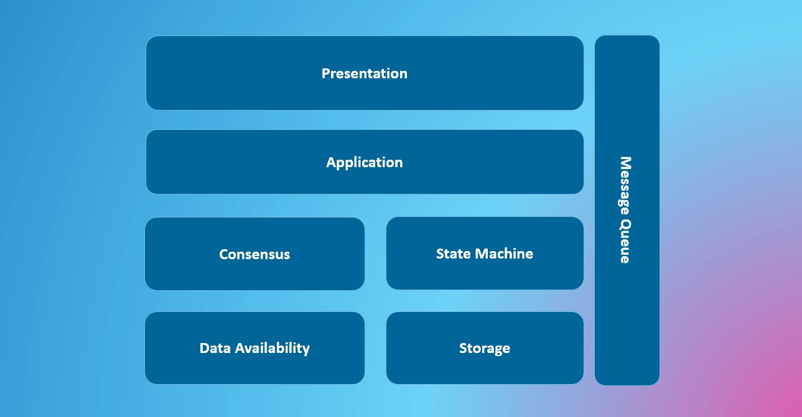

# 模块化区块链

模块化区块链是一个未经定义的概念，我们暂时用它来指代符合领域驱动设计思想的区块链架构，因此它有可能与你知道的“模块化”概念并不相同。

## 架构

**共识层和状态机**

区块链本质上是一个有限状态机，可以通过外部指令改变状态。为了就状态变化形成全球共识，我们需要一个共识层来确保这一点。它们是区块链的核心部分，共识层和状态机实际上是独立的。在 Substrate 框架中，有很多共识层 Pallet 与状态机组成 Runtime；在 Cosmos 中，状态机和共识层是明确解耦的；在以太坊的最新架构中，共识层和执行层也是解耦的。

在 Rollups 中，我们经常将共识层称为结算层，其中交易在链外执行，最终状态根保留在结算层，本质上服务于共识角色。

**消息队列服务**

消息传递层是软件工程中不可或缺的一部分，它允许系统模块之间进行可靠的通信，每个模块都各司其职。在区块链的背景下，我们很容易想到跨链消息，例如在两个链之间进行通信的跨链桥，或者像XCM（跨共识消息格式）和 IBC（区块链间通信）这样的跨链消息协议）。

事实上，另一个重要的消息传递层是链本身。我们将比特币、波卡和以太坊视为可靠的消息服务。比特币的 Ordinals、BRC20 和其他协议在比特币网络上传输顺序指令并对状态机进行协议化，理想情况下允许所有用户在不信任第三方的情况下验证交易。在以太坊生态系统中，早期就有通过日志实现ERC20的提议。

虽然铭文并不被大众认为是模块化区块链，但从技术角度来看，它将单体区块链作为消息队列服务，已经符合模块化区块链的思想。铭文的优势在于所有节点在无需沟通的情况下即可达成共识，极大地扩展了区块链的吞吐量。但劣势也显而易见，消息服务层只能传递极少的信息，使得铭文系统难以扩展，例如智能合约功能。如果我们将数据安全地存储在另一个模块，只在消息层发布数据的指针，并确保所有节点都能在任意时刻对数据可用性保持一致，我们就能极大地扩展铭文系统，这在比特币、以太坊等单体区块链上非常有用。

## 冰箱保险柜问题

毫无疑问，模块化区块链提高了系统吞吐量，但同时它将解决另一个更加重要的问题。不同的产品具有不用的安全假设，从而有不同的共识需求。例如社交网络中，关注关系交易对排序并不敏感，而Defi 和 NFT 交易的排序是系统安全中非常重要的一部分，但在统一共识的区块链中，他们需要为同样的共识机制付费。这就如同我们不把可乐放进冰箱，而是保险柜，我们称它为“可乐保险箱问题”。

考虑这样一种设计模式，在同一个结算层上的 Rollup 有不同的安全模型，他们通过某种协议进行交互，使得 Rollup 在相同成本的情况下实现了自适应的安全性。举例来说，用户期望社交网络类应用的交互是免费的，这要求“共识”要尽可能地轻。但社交网络产生的社交关系具有协议价值，被其他许多应用依赖，又要求“共识”尽可能地安全。为了解决这个矛盾，我们可以利用协议类应用大多数为“只读”的特点，设计一种“只读”的跨 Rollup 协议，当被依赖的应用受到挑战而被削减时，所有在两步之内依赖它的应用都同样被削减 。因此，即便社交网络是基于许可区块链的，出于安全性考量，依赖于它的应用也会同时验证它。于是使用越广泛的应用安全性越高，这就带来了一个安全性自适应但并不增加用户成本的交易范式，而且同时保证了链上数据可用性（在同一个结算层）。