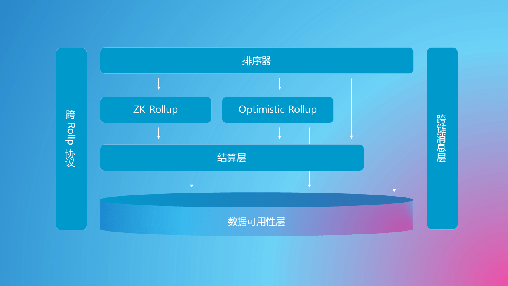

# 模块化区块链

模块化区块链是一个未经定义的概念，我们暂时用它来指代符合领域驱动设计思想的区块链架构，因此它有可能与你知道的“模块化”概念并不相同。我们用简短的篇幅来介绍模块化区块链解决的两个核心问题：

## 火车票酒店问题

目前的区块链各个模块是高度耦合的，在分片设计时这一点被放大，带来了被称为“火车票酒店问题“的设计难题。在此期间 Rollup 技术被作为一种 Layer2 方案，得到了快速发展，这是模块化区块链的雏形，它能够极大地增加区块链的 TPS 。随后，数据可用性层、排序器和消息服务逐步被解耦出来，模块化区块链的架构逐渐清晰。

- **排序器**： 交易排序和状态转换的转换
- **中间层**： 确保排序的合法性，状态转换的正确性，视具体设计实际上包含某种程度的“共识”
- **结算层**： 为验证证据、解决欺诈、资金结算、状态锚定等提供环境
- **消息层**： 为跨 Rollup 、跨结算层、跨链提供去中心化的消息服务
- **数据可用性层**： 为以上所有层级提供服务，确保交易数据实际可用和易用

## 冰箱保险柜问题

毫无疑问，模块化区块链提高了系统吞吐量，但同时它将解决另一个更加重要的问题。不同的产品具有不用的安全假设，从而有不同的共识需求。例如社交网络中，关注关系交易对排序并不敏感，而Defi 和 NFT 交易的排序是系统安全中非常重要的一部分，但在统一共识的区块链中，他们需要为同样的共识机制付费。这就如同我们不把可乐放进冰箱，而是保险柜，我们称它为“冰箱保险柜问题”。

考虑这样一种设计模式，在同一个结算层上的 Rollup 有不同的安全模型，他们通过某种协议进行交互，使得 Rollup 在相同成本的情况下实现了自适应的安全性。举例来说，用户期望社交网络类应用的交互是免费的，这要求“共识”要尽可能地轻。但社交网络产生的社交关系具有协议价值，被其他许多应用依赖，又要求“共识”尽可能地安全。为了解决这个矛盾，我们可以利用协议类应用大多数为“只读”的特点，设计一种“只读”的跨 Rollup 协议，当被依赖的应用受到挑战而被削减时，所有在两步之内依赖它的应用都同样被削减 。因此，即便社交网络是基于许可区块链的，出于安全性考量，依赖于它的应用也会同时验证它。于是使用越广泛的应用安全性越高，这就带来了一个安全性自适应但并不增加用户成本的交易范式，而且同时保证了链上数据可用性（在同一个结算层）。